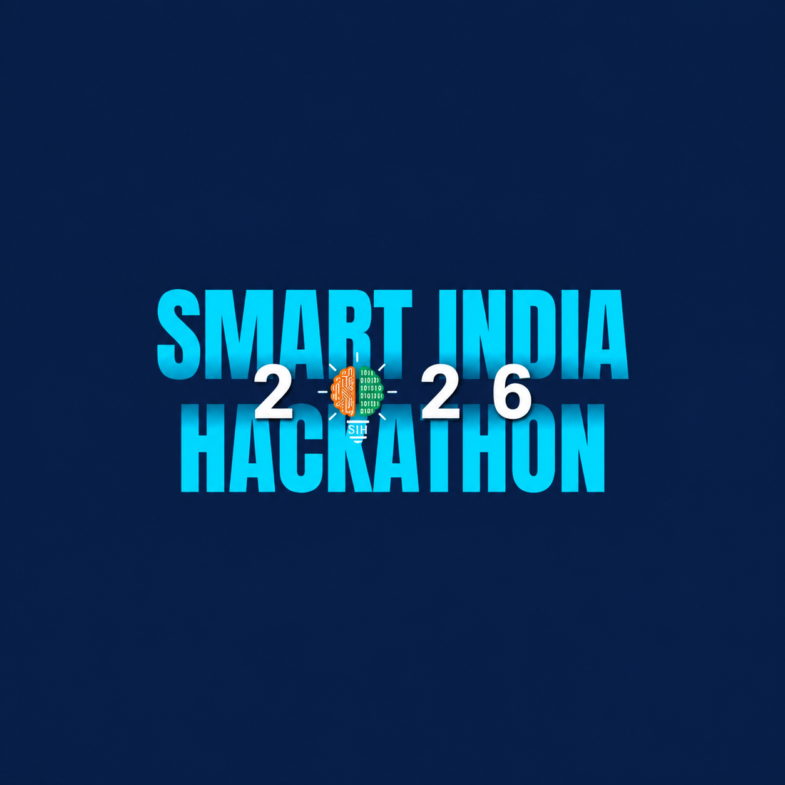

# 🚀 SIH 2026 Submission Template using GitHub Actions

This repository provides an **automated workflow** to manage **SIH 2026 project submissions** using **GitHub Issues & Pull Requests**.

## 📌 Features

- **Issue-Based Submissions** – Participants submit their projects via **GitHub Issues**  
- **Automatic PR Creation & Updates** – Converts issues into PRs and updates them if edited  
- **Submission Validation** – Ensures required fields exist in `submissions.json`  
- **Deadline Handling** – Marks late PRs with `[LATE]` and adds appropriate labels  
- **Automatic Merging** – PRs are merged when their associated issue is marked **completed**  
- **Clone Submitted Repositories** – Saves all valid submissions inside the repository

---

## 🔄 How It Works

### 1️⃣ Submitting a Project

1. Participants create a **GitHub Issue** using a predefined template.
2. If the issue is labeled **`project-submission`**, a PR is automatically generated.
3. The PR contains submission details and links to the participant's GitHub repository.

### 2️⃣ Validating & Reviewing

- PRs are checked for **missing fields** in `submissions.json`
- PRs **submitted late** are marked with `[LATE]` in the title and given the label `late-submission`
- Reviewers can approve and merge valid submissions

### 3️⃣ Automatic PR Merging

- If an issue is **marked as completed**, its associated PR is automatically merged.
- The project is then added to `submissions.json` in the repository.

### 4️⃣ Cloning Repositories

- Once a submission is merged, the workflow **clones the participant's GitHub repository** into the **`Submissions/`** folder.

---

## ⚙️ Workflows Overview

| **Workflow**                       | **Purpose**                                                   |
| ---------------------------------- | ------------------------------------------------------------- |
| **Convert Issue to PR**            | Converts an issue into a submission PR & updates if edited    |
| **PR Validation & Deadline Check** | Validates `submissions.json` & marks late submissions         |
| **Merge PR on Issue Close**        | Merges the associated PR when an issue is marked as completed |
| **Clone Repositories**             | Clones the submitted projects when a PR is merged             |

---

## 🚀 Usage

### 📝 Submitting a Project

1. Create a **GitHub Issue** using the submission template.
2. Add the label **`project-submission`** (It will be automatically added).
3. The system will automatically generate a **PR**.

### 🔍 Reviewing & Approving

- If the submission is **valid**, approve the PR.
- If it’s **late**, it will be marked `[LATE]`.
- If the issue is marked **completed**, the PR will **automatically merge**.

---

## ⚠️ Important Notes

- **Deadline:** The current submission deadline is **September 10, 2026, 7:00 PM IST**. Update the deadline in `config.yml` at the root of the repository to change it. The workflow reads the deadline from this YAML config file.
- **Late Submissions:** PRs submitted after the deadline will be marked with `[LATE]` in the title and the `late-submission` label. Reviewers can still approve and merge late submissions, but they will be clearly marked.
- **Template Format:** The workflows require the issue template format to remain unchanged. If you modify the template, update the extraction logic in the workflow accordingly.
- **Repository Cloning:** Only public repositories under 100MB will be cloned. Private or oversized repositories will be skipped, and maintainers will be notified of any failures.

---

## 🔧 Configuration
- **Add Labels:** Add labels `project-submission` and `late-submission` to your repository.
- **Deadline Date:** Update the `deadline` in `config.yml` at the root of the repository.
- **Required Fields in `submissions.json`**:
    ```json
    [
        {
            "name": "John Doe",
            "project_name": "Awesome App",
            "repository_url": "https://github.com/johndoe/awesome-app",
            "description": "This is a cool project!"
        }
    ]
    ```

---

## 🤝 Contributing

We welcome contributions! Please ensure your contributions adhere to standard contributing guidelines.
Thank you for your contributions!

---

## 📄 License

This project is licensed under the MIT License - see the LICENSE file for details.
